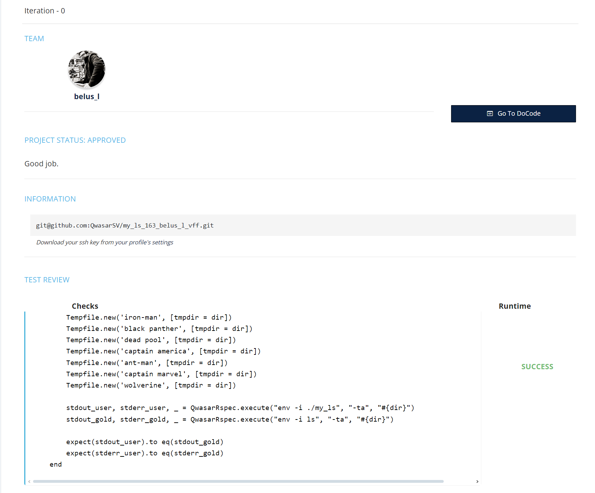

# my_qwasar_lib
Repository holding my qwasar master projects 


## Table of Contents
1. [Projects list](#projects-list)
2. [My Malloc](#my_malloc)
3. [My FTP](#my_ftp)


## Projects list
Project in order of creation:
| Language | Project Name | Review |
| -------- | ------------ |--------|
| cpp      | my_redis_client [view](https://github.com/Lbelus/my_qwasar_lib/tree/main/cpp/my_cpp_redis_client_575_belus_l_svg) | <a href="https://github.com/Lbelus/my_qwasar_lib/tree/main/public/redisClient.png"></a> |
| cpp      | my_ftp [view](https://github.com/Lbelus/my_qwasar_lib/tree/main/cpp/my_ftp_509_belus_l_cwo)                       | <a href="https://github.com/Lbelus/my_qwasar_lib/tree/main/public/ftp.png"></a> |
| cpp      | my_abstract_vm [view](https://github.com/Lbelus/my_qwasar_lib/tree/main/cpp/my_abstract_vm_508_belus_l_var)       | <a href="https://github.com/Lbelus/my_qwasar_lib/tree/main/public/abstractVm.png"></a> |
| c        | my_malloc [view](https://github.com/Lbelus/my_qwasar_lib/tree/main/c/my_malloc_436_belus_l_m1a)                   | <a href="https://github.com/Lbelus/my_qwasar_lib/tree/main/public/malloc.png"></a> |
| asm      | my_libasm [view](https://github.com/Lbelus/my_qwasar_lib/tree/main/asm/my_libasm_435_belus_l_suk)                 | <a href="https://github.com/Lbelus/my_qwasar_lib/tree/main/public/libasm.png"></a> |
| c        | my_curl [view](https://github.com/Lbelus/my_qwasar_lib/tree/main/c/my_curl_368_belus_l_zr1)                       | <a href="https://github.com/Lbelus/my_qwasar_lib/tree/main/public/curl.png"></a> |
| ruby     | my_sqlite/my_ruby_lib [view](https://github.com/Lbelus/my_qwasar_lib/tree/main/ruby/my_ruby_lib)                  | <a href="https://github.com/Lbelus/my_qwasar_lib/tree/main/public/sqlite.png"></a> |
| ruby     | bootcamp [view](https://github.com/Lbelus/my_qwasar_lib/tree/main/ruby/bootcamp)                                 | |
| c        | my_zsh [view](https://github.com/Lbelus/my_qwasar_lib/tree/main/c/my_zsh_402_belus_l_u1y)                         | <a href="https://github.com/Lbelus/my_qwasar_lib/tree/main/public/sqlite.png"></a> |
| c        | my_mouse [view](https://github.com/Lbelus/my_qwasar_lib/tree/main/c/my_mouse_297_belus_l_s4n)                     | <a href="https://github.com/Lbelus/my_qwasar_lib/tree/main/public/mouse.png"></a> |
| c        | my_bc [view](https://github.com/Lbelus/my_qwasar_lib/tree/main/c/my_bc_296_belus_l_ynf)                           | <a href="https://github.com/Lbelus/my_qwasar_lib/tree/main/public/bc.png"></a> |
| c        | my_bsq [view](https://github.com/Lbelus/my_qwasar_lib/tree/main/c/my_bsq_294_belus_l_gtc)                         | <a href="https://github.com/Lbelus/my_qwasar_lib/tree/main/public/bsq.png"></a> |
| c        | my_blockchain [view](https://github.com/Lbelus/my_qwasar_lib/tree/main/c/my_blockchain_173_belus_l_nmq)           | <a href="https://github.com/Lbelus/my_qwasar_lib/tree/main/public/blockchain.png"></a> |
| c        | my_readline [view](https://github.com/Lbelus/my_qwasar_lib/tree/main/c/my_readline_172_belus_l_6f-)               | <a href="https://github.com/Lbelus/my_qwasar_lib/tree/main/public/readline.png"></a> |
| c        | my_tar [view](https://github.com/Lbelus/my_qwasar_lib/tree/main/c/my_tar_166_belus_l_egy)                         | <a href="https://github.com/Lbelus/my_qwasar_lib/tree/main/public/tar.png"></a> |
| c        | my_ls [view](https://github.com/Lbelus/my_qwasar_lib/tree/main/c/my_ls_163_belus_l_vff)                           | <a href="https://github.com/Lbelus/my_qwasar_lib/tree/main/public/ls.png"></a> |
| c        | my_printf [view](https://github.com/Lbelus/my_qwasar_lib/tree/main/c/my_printf_70028_vfhfqu)                      | <a href="https://github.com/Lbelus/my_qwasar_lib/tree/main/public/printf.png"></a> |
| c        | extra [view](https://github.com/Lbelus/my_qwasar_lib/tree/main/c/extra)                                          | |
| python   | extra [view](https://github.com/Lbelus/my_qwasar_lib/tree/main/python)                                           | |


## My_Malloc

#### Description : 

A custom implementation of memory management allocation functions (malloc, calloc, realloc, free and malloc_usable_size) from stdlib. 

The project aim to :
- Replace those functions at runtime on any program;
- Reduce overhead by storing only the pages adresses inside a tree;
- A 256 bit bitmap is used to keep track of every allocation;

A more comprehensive readme is available at the project URL;

#### Why ? 

- Understand Memory allocation and management;
- Creating a lib in C;
- Do a LD_PRELOAD trick;

#### Technologies Used: 
C, asm (nasm64), Makefile

#### Usage:
```c
#include <main_header.h>

int main(void)
{
    char *ptr = malloc(10);
    if (ptr == NULL)
    {
        printf("Memory allocation failed\n");
        return 1;
    }
    strcpy(ptr, "Hello");
    printf("%s\n", ptr);
    free(ptr);
    return 0;
}
```

#### Installation:
From the project root dir

```bash
make
```

```bash
LD_PRELOAD=./libmymalloc.so ls
```
```bash
unset LD_PRELOAD
```

```bash
make fclean
```


/!\ make debug do not produce a usable binary/!\

#### Project URL:
https://github.com/Lbelus/my_qwasar_lib/tree/main/c/my_malloc_436_belus_l_m1a


## My_ftp

## Description

An implementation of a FTP server following a strict BNF through a custom LEXER/PARSER. 
The users needs to be able to roam through the directories independently from one another and retreive files.

Active and passive mode to tranfer the file is available: 
- Active Mode will have the server connect to client; 
- Passive Mode will let the user connect to server; 

The Project has three main components:
- LEXER/PARSER;
- Server FTP;
- Client FTP;

#### Why ? 
- Understand the limitation arround socket;
- Learn how to use mulithreading;
- learn how to handle multiple client at once;

#### Technologies Used: 
CPP, C, asm (nasm64), Makefile

#### Installation:
From the main directory : 
```bash
make
```
From the clientFTP directory :

```bash
make
```
run the server then the client


### usage
The Following CMD are available 

Every command existing on the bnf will receive an answer from the server, but only USER, PASS, CWD, PWD, LIST, PASV, PORT and RETR have been implemented;


#### Project URL:
https://github.com/Lbelus/my_qwasar_lib/tree/main/cpp/my_ftp_509_belus_l_cwo


<span><i>Made at <a href='https://qwasar.io'>Qwasar SV -- Software Engineering School</a></i></span>
<span></span>